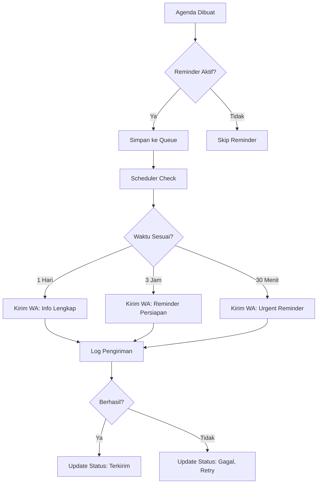

# ANALISA SISTEM JADWAL & AGENDA PERUSAHAAN/PIMPINAN

**Tanggal Analisa:** 5 Januari 2026  
**Status:** Draft - Menunggu Persetujuan  
**Prioritas:** Medium-High

---

## 📋 LATAR BELAKANG

Perusahaan membutuhkan sistem terpusat untuk mengelola jadwal dan agenda pimpinan/perusahaan seperti:
- Undangan acara
- Rapat penting
- Kunjungan tamu
- Event perusahaan
- Deadline proyek
- Dan agenda lainnya

Sistem harus dilengkapi dengan **reminder/pengingat otomatis** dan **informasi detail lengkap** termasuk dress code.

---

## 🎯 TUJUAN SISTEM

1. **Sentralisasi Jadwal** - Satu tempat untuk semua agenda perusahaan
2. **Pengingat Otomatis** - Notifikasi sebelum acara dimulai
3. **Detail Lengkap** - Informasi komprehensif setiap agenda
4. **Tracking Kehadiran** - Siapa saja yang terlibat/hadir
5. **Riwayat Agenda** - Arsip lengkap agenda yang sudah lewat

---

## 🗂️ STRUKTUR DATABASE

### Tabel: `agenda_perusahaan`

```sql
CREATE TABLE agenda_perusahaan (
    id BIGINT UNSIGNED PRIMARY KEY AUTO_INCREMENT,
    
    -- Informasi Dasar
    nomor_agenda VARCHAR(50) UNIQUE NOT NULL COMMENT 'AGD-YYYYMM-0001',
    judul VARCHAR(255) NOT NULL,
    deskripsi TEXT,
    tipe_agenda ENUM('undangan', 'rapat', 'kunjungan', 'event', 'deadline', 'lainnya') NOT NULL,
    kategori_agenda ENUM('internal', 'eksternal', 'pemerintah', 'vendor', 'client', 'umum') DEFAULT 'internal',
    
    -- Waktu & Tempat
    tanggal_mulai DATE NOT NULL,
    waktu_mulai TIME NOT NULL,
    tanggal_selesai DATE,
    waktu_selesai TIME,
    durasi_menit INT COMMENT 'Estimasi durasi dalam menit',
    lokasi VARCHAR(255),
    lokasi_detail TEXT COMMENT 'Alamat lengkap, link maps, ruangan, dll',
    is_online BOOLEAN DEFAULT FALSE,
    link_meeting TEXT COMMENT 'Zoom, GMeet, Teams, dll',
    
    -- Detail Acara
    penyelenggara VARCHAR(255) COMMENT 'Nama instansi/orang yang mengadakan',
    contact_person VARCHAR(255),
    no_telp_cp VARCHAR(20),
    email_cp VARCHAR(255),
    
    -- Dress Code & Requirements
    dress_code ENUM('formal', 'semi_formal', 'casual', 'bebas_rapi', 'batik', 'khusus') DEFAULT 'bebas_rapi',
    dress_code_keterangan TEXT COMMENT 'Detail dress code jika khusus',
    perlengkapan_dibawa TEXT COMMENT 'Barang/dokumen yang perlu dibawa',
    
    -- Peserta
    peserta_internal TEXT COMMENT 'JSON array user_id yang hadir',
    peserta_eksternal TEXT COMMENT 'Nama-nama tamu eksternal',
    jumlah_peserta_estimasi INT,
    
    -- Anggaran & Dokumen
    ada_anggaran BOOLEAN DEFAULT FALSE,
    nominal_anggaran DECIMAL(15,2),
    sumber_anggaran VARCHAR(100),
    dokumen_undangan VARCHAR(255) COMMENT 'File undangan/surat',
    dokumen_rundown VARCHAR(255) COMMENT 'File rundown acara',
    dokumen_materi VARCHAR(255) COMMENT 'File presentasi/materi',
    dokumen_lainnya TEXT COMMENT 'JSON array file lainnya',
    
    -- Status & Priority
    status ENUM('draft', 'terjadwal', 'berlangsung', 'selesai', 'dibatalkan') DEFAULT 'draft',
    prioritas ENUM('rendah', 'sedang', 'tinggi', 'urgent') DEFAULT 'sedang',
    is_wajib_hadir BOOLEAN DEFAULT FALSE COMMENT 'Wajib dihadiri pimpinan',
    
    -- Reminder Settings
    reminder_aktif BOOLEAN DEFAULT TRUE,
    reminder_1_hari BOOLEAN DEFAULT TRUE,
    reminder_3_jam BOOLEAN DEFAULT TRUE,
    reminder_30_menit BOOLEAN DEFAULT TRUE,
    reminder_custom_menit INT COMMENT 'Reminder custom (menit sebelum acara)',
    
    -- Hasil & Tindak Lanjut
    kehadiran_konfirmasi ENUM('belum', 'hadir', 'tidak_hadir', 'diwakilkan') DEFAULT 'belum',
    nama_perwakilan VARCHAR(255) COMMENT 'Jika diwakilkan',
    catatan_kehadiran TEXT,
    hasil_agenda TEXT COMMENT 'Kesimpulan/hasil setelah acara',
    tindak_lanjut TEXT COMMENT 'Action items setelah acara',
    foto_dokumentasi TEXT COMMENT 'JSON array foto',
    
    -- Tracking
    dibuat_oleh BIGINT UNSIGNED,
    diupdate_oleh BIGINT UNSIGNED,
    dibatalkan_oleh BIGINT UNSIGNED,
    tanggal_dibatalkan DATETIME,
    alasan_dibatalkan TEXT,
    
    -- Meta
    created_at TIMESTAMP DEFAULT CURRENT_TIMESTAMP,
    updated_at TIMESTAMP DEFAULT CURRENT_TIMESTAMP ON UPDATE CURRENT_TIMESTAMP,
    deleted_at TIMESTAMP NULL,
    
    -- Foreign Keys
    FOREIGN KEY (dibuat_oleh) REFERENCES users(id) ON DELETE SET NULL,
    FOREIGN KEY (diupdate_oleh) REFERENCES users(id) ON DELETE SET NULL,
    FOREIGN KEY (dibatalkan_oleh) REFERENCES users(id) ON DELETE SET NULL,
    
    -- Indexes
    INDEX idx_tanggal_mulai (tanggal_mulai),
    INDEX idx_status (status),
    INDEX idx_tipe (tipe_agenda),
    INDEX idx_prioritas (prioritas)
) ENGINE=InnoDB DEFAULT CHARSET=utf8mb4 COLLATE=utf8mb4_unicode_ci;
```

### Tabel: `agenda_reminder_log`

```sql
CREATE TABLE agenda_reminder_log (
    id BIGINT UNSIGNED PRIMARY KEY AUTO_INCREMENT,
    agenda_id BIGINT UNSIGNED NOT NULL,
    
    tipe_reminder ENUM('1_hari', '3_jam', '30_menit', 'custom') NOT NULL,
    menit_sebelum INT NOT NULL,
    
    metode_reminder ENUM('whatsapp', 'email', 'notification', 'sms') NOT NULL,
    tujuan VARCHAR(255) NOT NULL COMMENT 'Nomor/email penerima',
    
    status ENUM('pending', 'terkirim', 'gagal') DEFAULT 'pending',
    tanggal_kirim DATETIME,
    error_message TEXT,
    
    created_at TIMESTAMP DEFAULT CURRENT_TIMESTAMP,
    
    FOREIGN KEY (agenda_id) REFERENCES agenda_perusahaan(id) ON DELETE CASCADE
) ENGINE=InnoDB DEFAULT CHARSET=utf8mb4 COLLATE=utf8mb4_unicode_ci;
```

### Tabel: `agenda_history`

```sql
CREATE TABLE agenda_history (
    id BIGINT UNSIGNED PRIMARY KEY AUTO_INCREMENT,
    agenda_id BIGINT UNSIGNED NOT NULL,
    
    aksi VARCHAR(100) NOT NULL COMMENT 'created, updated, status_changed, dll',
    perubahan TEXT COMMENT 'JSON data perubahan',
    catatan TEXT,
    
    user_id BIGINT UNSIGNED,
    user_name VARCHAR(255),
    
    created_at TIMESTAMP DEFAULT CURRENT_TIMESTAMP,
    
    FOREIGN KEY (agenda_id) REFERENCES agenda_perusahaan(id) ON DELETE CASCADE,
    FOREIGN KEY (user_id) REFERENCES users(id) ON DELETE SET NULL
) ENGINE=InnoDB DEFAULT CHARSET=utf8mb4 COLLATE=utf8mb4_unicode_ci;
```

---

## 🎨 FITUR UTAMA

### 1. **Dashboard Agenda**
```
📅 Kalender View
├── Tampilan Kalender Bulanan
├── List View (Timeline)
├── Filter: Tipe, Status, Prioritas
└── Quick Stats: Hari ini, Minggu ini, Bulan ini
```

### 2. **Input Agenda Baru**
```
Form Lengkap:
├── Tab 1: Info Dasar (Judul, Tipe, Tanggal, Lokasi)
├── Tab 2: Detail (Penyelenggara, Contact, Peserta)
├── Tab 3: Dress Code & Perlengkapan
├── Tab 4: Anggaran & Dokumen
├── Tab 5: Pengaturan Reminder
└── Tab 6: Catatan Tambahan
```

### 3. **Detail Agenda**
```
Halaman Detail Komprehensif:
├── Header: Judul, Status Badge, Priority Badge
├── Section Info Waktu & Countdown Timer
├── Section Lokasi (dengan Maps embed)
├── Section Dress Code (dengan icon visual)
├── Section Peserta (Internal + Eksternal)
├── Section Dokumen (Download/Preview)
├── Section Reminder Status
├── Section Kehadiran & Hasil
└── Section Timeline History
```

### 4. **Sistem Reminder**

#### Otomatis via Scheduler (Laravel)
```php
// app/Console/Kernel.php
protected function schedule(Schedule $schedule)
{
    // Cek agenda 1 hari sebelumnya
    $schedule->command('agenda:reminder --type=1_hari')
             ->dailyAt('08:00');
    
    // Cek agenda 3 jam sebelumnya
    $schedule->command('agenda:reminder --type=3_jam')
             ->hourly();
    
    // Cek agenda 30 menit sebelumnya
    $schedule->command('agenda:reminder --type=30_menit')
             ->everyFifteenMinutes();
}
```

#### Metode Pengiriman
- **WhatsApp** (via WA Gateway existing)
- **Email** (via Mail service)
- **Push Notification** (jika ada)
- **SMS** (optional)

### 5. **Laporan & Export**
```
Fitur Export:
├── PDF: Jadwal Bulanan
├── PDF: Detail per Agenda
├── Excel: Rekap Agenda Periode
├── ICS: Export ke Google Calendar
└── Print: Rundown Harian
```

---

## 📱 USER INTERFACE DESIGN

### Menu Sidebar
```
📅 Jadwal & Agenda
├── 📋 Dashboard Agenda
├── ➕ Agenda Baru
├── 📆 Kalender
├── 🔔 Reminder Aktif
├── ✅ Agenda Selesai
└── 📊 Laporan
```

### Dashboard Layout
```
+----------------------------------------------------------+
|  [Hari Ini: 3]  [Minggu Ini: 12]  [Bulan Ini: 45]      |
+----------------------------------------------------------+
|                    KALENDER VIEW                          |
|  +----------------------------------------------------+   |
|  | SUN | MON | TUE | WED | THU | FRI | SAT |          |   |
|  |  1  |  2  |  3● |  4● |  5  |  6● |  7  |          |   |
|  |  8● |  9  | 10  | 11● | 12  | 13  | 14  |          |   |
|  +----------------------------------------------------+   |
+----------------------------------------------------------+
|                  AGENDA MENDATANG                         |
|  +----------------------------------------------------+   |
|  | [URGENT] Rapat Direksi - 10:00 WIB                 |   |
|  | 📍 Ruang Meeting Lantai 3 | 👔 Formal              |   |
|  | [Reminder: 30 menit lagi]                          |   |
|  +----------------------------------------------------+   |
|  | [TINGGI] Kunjungan Bupati - 14:00 WIB             |   |
|  | 📍 Pendopo Kantor | 👔 Batik Resmi                |   |
|  +----------------------------------------------------+   |
+----------------------------------------------------------+
```

---

## 🔔 ALUR REMINDER



---

## 📝 TEMPLATE REMINDER

### WhatsApp Template (1 Hari Sebelum)
```
🔔 *REMINDER AGENDA*

*[URGENT] Rapat Evaluasi Kinerja Q4*

📅 Besok, Senin, 6 Januari 2026
🕐 10:00 - 12:00 WIB (2 jam)
📍 Ruang Meeting Lantai 3

👔 *Dress Code:* Formal (Kemeja + Celana Bahan)

📋 *Penyelenggara:* PT Bumi Sultan Agung
👤 *Contact Person:* Bpk. Ahmad (0812-3456-7890)

📌 *Perlengkapan:*
- Laptop
- Dokumen Laporan Q4
- ATK

👥 *Peserta:*
- Direktur Utama
- Direktur Keuangan
- Manager HRD
- Manager Operasional

⚠️ Kehadiran WAJIB

---
Detail lengkap: [Link ke Detail Agenda]
```

### WhatsApp Template (3 Jam Sebelum)
```
⏰ *3 JAM LAGI*

Agenda: *Rapat Evaluasi Kinerja Q4*
Waktu: 10:00 WIB
Lokasi: Ruang Meeting Lt. 3

👔 Formal | 📋 Bawa Dokumen Q4

Pastikan sudah siap! 🚀
```

### WhatsApp Template (30 Menit Sebelum)
```
🚨 *30 MENIT LAGI!*

*Rapat Evaluasi Kinerja Q4*
Pukul 10:00 WIB
Ruang Meeting Lt. 3

Segera bersiap! ⏱️
```

---

## 🎯 ROLE & PERMISSION

### Role Access
```
Super Admin / Direktur
├── Full Access (CRUD semua agenda)
├── Approve/Reject agenda
└── Lihat semua laporan

Manager / Sekretaris
├── Create & Edit agenda
├── Konfirmasi kehadiran
└── Input hasil agenda

Staff
├── View agenda yang relevan
└── Konfirmasi kehadiran sendiri

```

### Permission List
```php
'agenda.view'          => 'Lihat Agenda'
'agenda.create'        => 'Buat Agenda Baru'
'agenda.edit'          => 'Edit Agenda'
'agenda.delete'        => 'Hapus Agenda'
'agenda.confirm'       => 'Konfirmasi Kehadiran'
'agenda.result'        => 'Input Hasil Agenda'
'agenda.export'        => 'Export Laporan'
'agenda.setting'       => 'Pengaturan Reminder'
```

---

## 🛠️ TEKNOLOGI & INTEGRASI

### Backend
- **Laravel 10+** (existing framework)
- **Eloquent ORM** untuk database
- **Laravel Scheduler** untuk reminder otomatis
- **Queue Jobs** untuk pengiriman reminder

### Notification Services
- **WA Gateway** (existing system)
- **Laravel Mail** untuk email
- **Laravel Notifications** untuk push notif

### Frontend
- **Blade Templates** (existing)
- **FullCalendar.js** untuk kalender view
- **Moment.js** untuk handling tanggal
- **Select2** untuk multi-select peserta
- **Dropzone.js** untuk upload dokumen

### Export
- **DomPDF** untuk PDF generation
- **Maatwebsite/Excel** untuk Excel export
- **ICS Generator** untuk calendar export

---

## 📊 CONTOH USE CASE

### Use Case 1: Undangan dari Pemerintah
```
Input:
- Tipe: Undangan
- Kategori: Pemerintah
- Judul: "Sosialisasi Peraturan Daerah No. 5 Tahun 2026"
- Tanggal: 15 Januari 2026, 09:00 - 12:00 WIB
- Lokasi: Pendopo Bupati
- Dress Code: Batik Resmi
- Peserta Internal: Direktur Utama (wajib)
- Dokumen: Surat Undangan (scan PDF)
- Reminder: 1 hari, 3 jam, 30 menit

Aksi Sistem:
1. Generate nomor: AGD-202601-0001
2. Schedule 3 reminder otomatis
3. Kirim notifikasi ke Direktur Utama
4. Tampilkan di dashboard dengan badge URGENT
```

### Use Case 2: Rapat Internal Bulanan
```
Input:
- Tipe: Rapat
- Kategori: Internal
- Judul: "Rapat Evaluasi Bulanan"
- Recurring: Ya (Setiap tanggal 5)
- Lokasi: Ruang Meeting Lt. 3
- Dress Code: Bebas Rapi
- Peserta: Semua Manager + Direktur
- Rundown: Upload file
- Reminder: 1 hari, 3 jam

Aksi Sistem:
1. Auto-generate recurring agenda untuk 12 bulan
2. Kirim calendar invite ke semua peserta
3. Reminder otomatis setiap bulan
```

### Use Case 3: Deadline Proyek
```
Input:
- Tipe: Deadline
- Judul: "Submission Proposal Tender XYZ"
- Tanggal: 20 Januari 2026, 16:00 WIB
- Prioritas: URGENT
- Peserta: Tim Proyek
- Dokumen: Draft Proposal
- Reminder: 3 hari, 1 hari, 3 jam

Aksi Sistem:
1. Countdown timer di dashboard
2. Reminder ekstra (custom 3 hari sebelum)
3. Status tracking progress
4. Notifikasi jika mendekati deadline
```

---

## 📈 ROADMAP IMPLEMENTASI

### Phase 1: Core Features (Week 1-2)
- ✅ Database migration
- ✅ Model & Migration
- ✅ CRUD Agenda (Controller + Views)
- ✅ Dashboard basic
- ✅ Form input lengkap

### Phase 2: Calendar & Display (Week 2-3)
- 📅 Integrasi FullCalendar
- 🔍 Filter & Search
- 📱 Responsive design
- 🎨 UI/UX enhancement

### Phase 3: Reminder System (Week 3-4)
- ⏰ Laravel Scheduler setup
- 📨 WA Gateway integration
- 📧 Email notification
- 📝 Log reminder

### Phase 4: Advanced Features (Week 4-5)
- 📊 Laporan & Export
- 🔄 Recurring agenda
- 📷 Upload foto dokumentasi
- 💾 Backup & Archive

### Phase 5: Testing & Polish (Week 5-6)
- 🧪 Testing menyeluruh
- 🐛 Bug fixing
- 📖 User documentation
- 🚀 Deployment

---

## 💡 FITUR TAMBAHAN (OPTIONAL)

1. **Integrasi Google Calendar** - Sync 2 arah
2. **Absensi Digital** - QR Code check-in
3. **Live Location** - GPS tracking peserta
4. **Video Conference** - Integrasi Zoom/GMeet
5. **Budget Tracking** - Realisasi vs Anggaran
6. **Survey Feedback** - Evaluasi acara
7. **AI Scheduling** - Smart suggestion waktu meeting
8. **Conflict Detection** - Cek bentrok jadwal

---

## 🔒 SECURITY & PRIVACY

1. **Role-Based Access** - Hanya lihat agenda yang relevan
2. **File Encryption** - Dokumen sensitif terenkripsi
3. **Audit Trail** - Log semua perubahan
4. **Soft Delete** - Data tidak benar-benar terhapus
5. **Backup Otomatis** - Daily backup database

---

## 📝 KESIMPULAN

Sistem Jadwal & Agenda ini akan memberikan:
- ✅ **Sentralisasi** semua informasi jadwal
- ✅ **Otomasi** reminder multi-channel
- ✅ **Transparansi** untuk semua stakeholder
- ✅ **Efisiensi** dalam koordinasi
- ✅ **Dokumentasi** lengkap setiap agenda

**Estimasi Waktu:** 5-6 minggu  
**Estimasi Effort:** 1 Full-stack Developer  
**Dependencies:** WA Gateway (existing), Email Service (existing)

---

## 🤔 PERTANYAAN UNTUK DIKLARIFIKASI

1. Apakah reminder cukup via **WhatsApp** saja atau perlu **Email + Push Notif** juga?
2. Apakah perlu fitur **recurring/berulang** untuk agenda rutin?
3. Apakah perlu **approval workflow** untuk membuat agenda (review dulu)?
4. Apakah perlu integrasi dengan **sistem lain** (HR, Keuangan, dll)?
5. Berapa **level prioritas** yang dibutuhkan? (saat ini: Rendah, Sedang, Tinggi, Urgent)
6. Apakah perlu **multi-language** (Indonesia/Inggris)?
7. Apakah ada **role khusus** untuk Sekretaris/Admin yang handle jadwal?

---

**Dibuat oleh:** AI Assistant  
**Tanggal:** 5 Januari 2026  
**Status:** Menunggu Review & Approval
